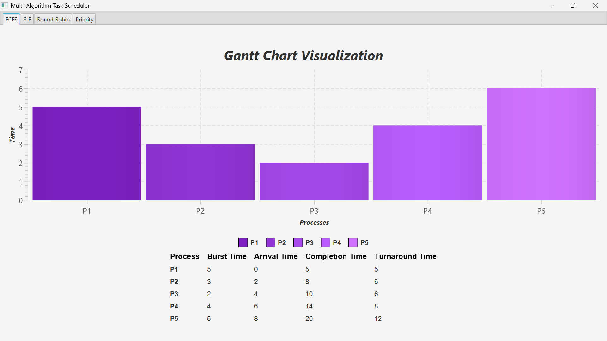
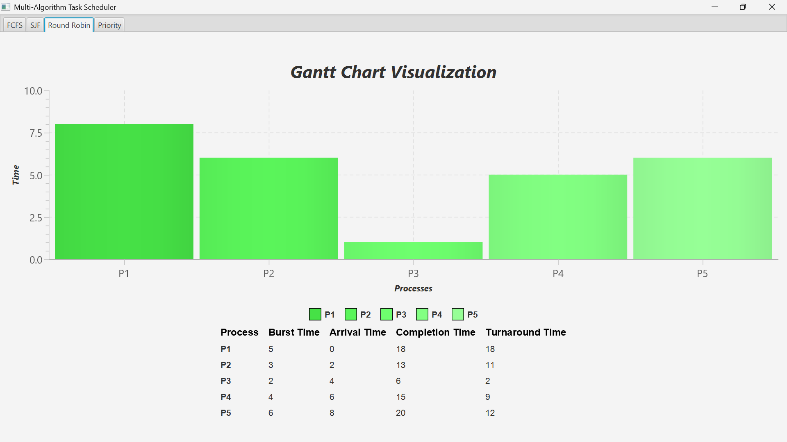
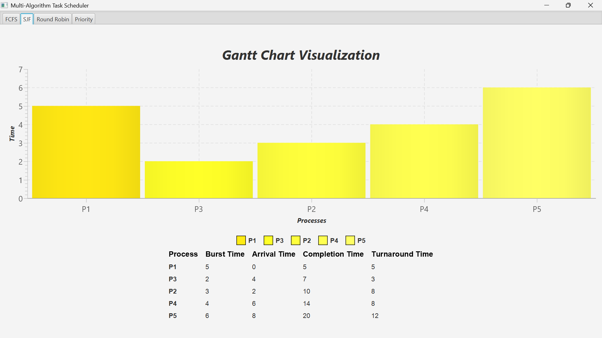
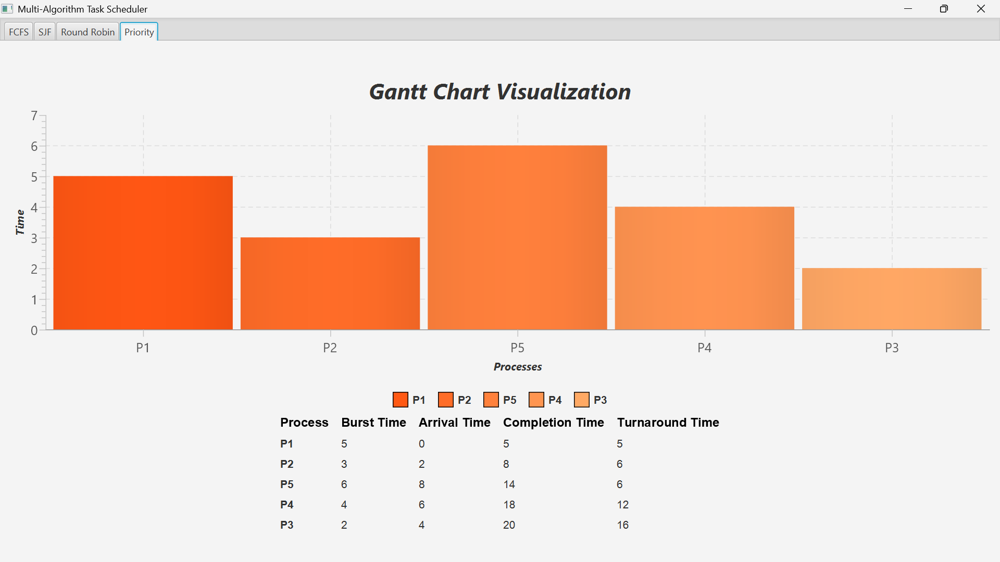

# 🖥️ Multi-Algorithm-Task-Scheduler

This repository contains a collection of **Multi-Algorithm-Task-Scheduler**, implemented in Java. These algorithms demonstrate the execution order of processes in a simulated CPU environment, aiming to optimize efficiency, fairness, and adherence to various scheduling policies.

---

## ✨ Features

- **Implemented Algorithms**:
  - 🟢 **First Come First Serve (FCFS)**: Executes processes in the order they arrive.
  - 🔵 **Round Robin (RR)**: Time-sharing algorithm with a fixed time quantum.
  - 🟡 **Shortest Job First (SJF)**: Selects the process with the smallest burst time.
  - 🔴 **Priority Scheduling**: Executes processes based on priority levels.
- **Process Attributes**:
  - `Arrival Time`, `Burst Time`, `Priority`, `Start Time`, `Completion Time`, `Turnaround Time`, `Waiting Time`, and `Remaining Time` (for RR).
- **Modular Framework**: Scheduling algorithms extend a common `Scheduler` superclass.

---
### Example Output Charts
**FCFS**:  
  

**Round Robin**:  
  

**Shortest Job First (SJF)**:  
  

**Priority Scheduling**:  
 

---

## 🛠️ Installation

### Clone the Repository
```bash
git clone https://github.com/saisindusrig/Multi-Algorithm-Task-Scheduler
cd Multi-Algorithm-Task-Scheduler
```
Compile the Code
Using your IDE or the terminal:

```bash
javac -d bin src/**/*.java
```
---

## 📊 Scheduling Algorithms Overview

### 1️⃣ First Come First Serve (FCFS)
- 🟢 Execution Order: Based on arrival time.
- ⏱️ Handles idle time when no process is ready.

### 2️⃣ Round Robin (RR)
- 🔄 Time Quantum: Fixed time slice per process.
- ♻️ Processes re-enter the queue if unfinished.

### 3️⃣ Shortest Job First (SJF)
- 📉 Selection: The process with the shortest burst time is executed.
- 🔒 Non-preemptive approach ensures fairness for shorter jobs.

### 4️⃣ Priority Scheduling
- 📌 Selection: Based on priority level (lower value = higher priority).
- ⚖️ Ties resolved by arrival time.

## 📂 Project Structure

```
Multi-Algorithm-Task-Scheduler/
├── src/
│   ├── scheduler/
│   │   ├── algorithms/
│   │   │   ├── FCFS.java
│   │   │   ├── RR.java
│   │   │   ├── SJF.java
│   │   │   ├── PriorityScheduler.java
│   │   │   ├── Scheduler.java        
│   │   ├── models/
│   │   │   ├── Process.java
│   │   ├── ui/
│   │   │   ├── GanttChart.java
│   ├── SchedulerMain.java
├── images/
│   ├── fcfschart.png         
│   ├── roundrobinchart.png           
│   ├── sjfchart.png         
│   ├── prioritychart.png     
├── README.md

```

## 🛠️ Tools Used
-Java
-JavaFX

